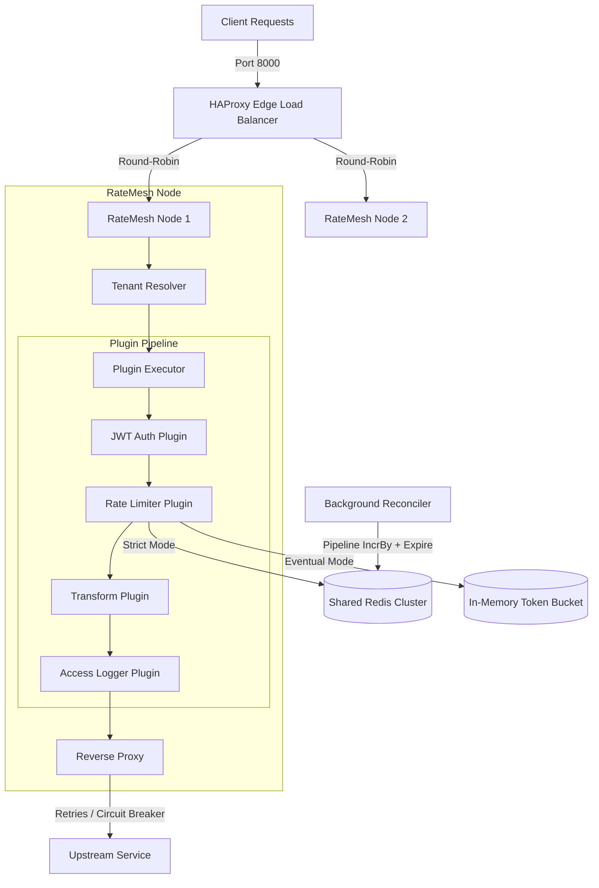

# RateMesh

**RateMesh** is a high-performance, multi-tenant **Distributed Rate Limiter & API Gateway** written in Go. It supports strict rate limiting (Redis-backed via atomic Lua scripts) and eventual consistency rate limiting (in-memory token buckets synchronized asynchronously to Redis using pipelining).

---

## Architecture Diagram



---

## Features

- **Multi-Tenant Gateway Routing**: Automatically resolves tenant context using request headers (`X-Tenant-ID`), query parameters (`?tenant_id=`), or dynamic subdomains (`tenant-a.localhost`).
- **Dual-Mode Rate Limiting**:
  - **Strict Mode**: Synchronous, Redis-backed rate limiting using atomic Lua scripts (supports Token Bucket and Sliding Window algorithms).
  - **Eventual Consistency Mode**: Uses lock-free in-memory token buckets on the hot path for maximum throughput, with background goroutines reconciling deltas to Redis using pipelines.
  - **Soft Correction (Throttling)**: Reduces the local token refill rate by **75%** if a global quota breach is detected, letting the system smoothly recover instead of hard-rejecting requests.
- **Extensible Plugin Pipeline**: Runs priority-ordered request and response interceptors. Built-in plugins include:
  - **JWT Authentication** (validates signatures via `golang-jwt/v5`).
  - **Header Transformations** (injects/removes request & response headers).
  - **Access logging** (tracks latency per request).
- **Observability**: Exposes scrapable Prometheus metrics (`/metrics`) and exports OpenTelemetry traces via OTLP gRPC.
- **Upstream Resilience**: Protects downstreams using a circuit breaker (`gobreaker`) and an automatic **3x retry loop** with request body cloning support.

---

## Directory Layout

```text
├── cmd/
│   └── gateway/
│       └── main.go                 # Main entrypoint & service orchestration
├── internal/
│   ├── db/
│   │   ├── migrations/             # Goose schema migrations & seed files
│   │   └── db.go                   # Postgres connection pool
│   ├── gateway/
│   │   ├── proxy.go                # Reverse proxy with circuit breaker & retries
│   │   ├── router.go               # Chi router setup & routes
│   │   └── tenant_resolver.go      # Multi-tenant extractor middleware
│   ├── observability/
│   │   ├── metrics.go              # Prometheus counters & histograms
│   │   └── tracing.go              # OpenTelemetry OTLP tracer setup
│   ├── plugin/
│   │   ├── builtin/                # Built-in Auth, Logging, Transform plugins
│   │   ├── interface.go            # GatewayPlugin & context helper definitions
│   │   ├── middleware.go           # Plugin execution runner middleware
│   │   └── registry.go             # Priority-ordered plugin registry
│   ├── policy/
│   │   ├── cache.go                # Redis cache layer
│   │   ├── context.go              # Context keys & helpers
│   │   ├── model.go                # Tenant, RoutePolicy & Plugin models
│   │   ├── repository.go           # Database repository
│   │   └── service.go              # Policy resolver service
│   ├── ratelimit/
│   │   ├── lua/                    # Redis Token Bucket & Sliding Window Lua scripts
│   │   ├── local_bucket.go         # Eventual consistency in-memory token bucket
│   │   ├── middleware.go           # Rate limit plugin wrapper
│   │   ├── reconciler.go           # Periodic background Redis sync loop
│   │   └── strategy.go             # Strict Redis rate limit strategies
│   └── redisclient/
│       └── client.go               # Redis connection manager
├── pkg/
│   └── config/
│       └── config.go               # Environment variables loader
├── tests/
│   └── load/
│       └── load_test.js            # k6 load testing script
├── Dockerfile                      # Two-stage gateway Docker file
└── docker-compose.yml              # Cluster orchestration config
```

---

## Quick Start

### Prerequisites
Make sure you have [Docker](https://www.docker.com/) and [Docker Compose](https://docs.docker.com/compose/) installed.

### Spin up the Cluster
Run the following command in the project root directory:
```bash
docker-compose up --build -d
```
This command automatically:
1. Spins up Postgres 15 and Redis 7.
2. Runs Goose database migrations and seeds a load-test tenant (`d04a6cb1-5bb5-4c07-b08e-327c62d08a54`) and two API endpoints.
3. Builds and launches 2 gateway nodes.
4. Spins up HAProxy, forwarding port `8000` to the gateway instances.
5. Launches a mock Upstream echo server.

### Verify Scraper Metrics
You can curl the gateway monitoring endpoint directly:
```bash
curl http://localhost:8000/metrics
```

---

## Testing & Load Testing

### Run Unit & Integration Tests
Run tests with the race detector to ensure concurrency safety:
```bash
go test -v -race ./...
```

### Run k6 Load Test
If you have [k6](https://k6.io/) installed, you can benchmark the cluster performance:
```bash
k6 run tests/load/load_test.js
```
The script will hit both strict and eventual mode routes across 50 virtual users through the HAProxy load balancer.
